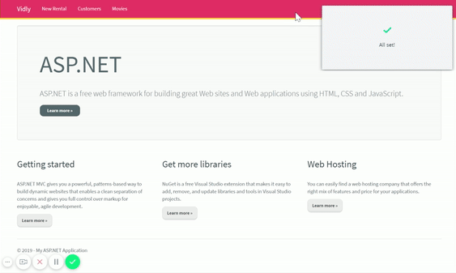

# Vidly

A movie rental application built with C# / ASP.NET MVC.

---

---

### Features
- CRUD operations
- RESTful services via ASP.NET Web API
- Security, authentication, and authorization via ASP.NET Identity
- Toast notifications via Toastr.js
- Use of Bootstrap themes
- Use of jQuery plugins
- Autocompletion via Typeahead.js